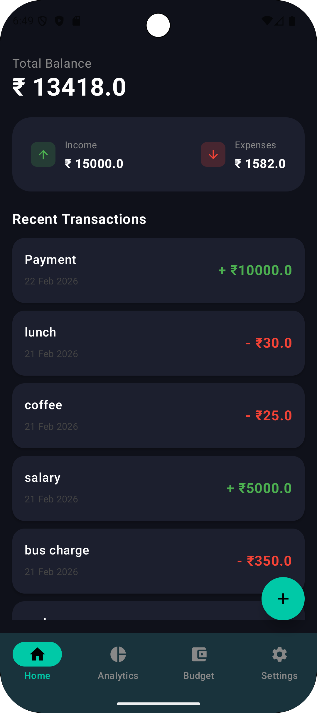
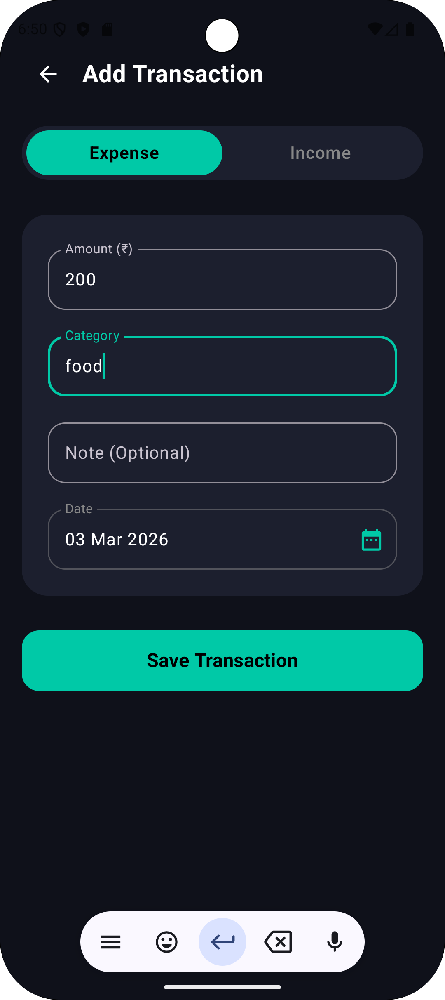
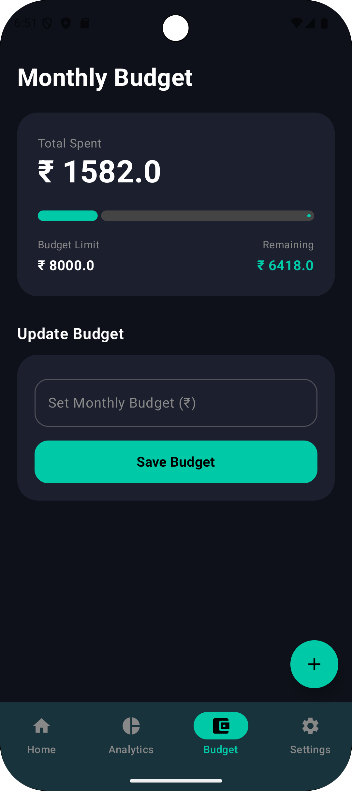
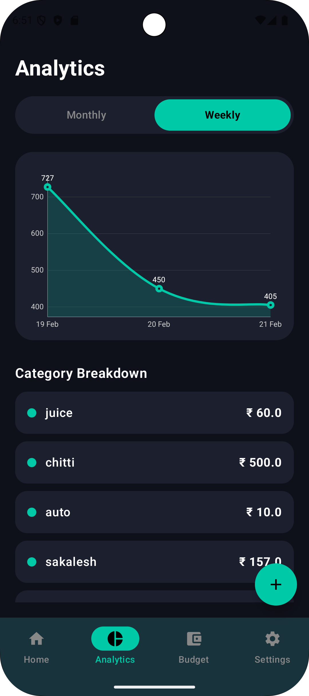
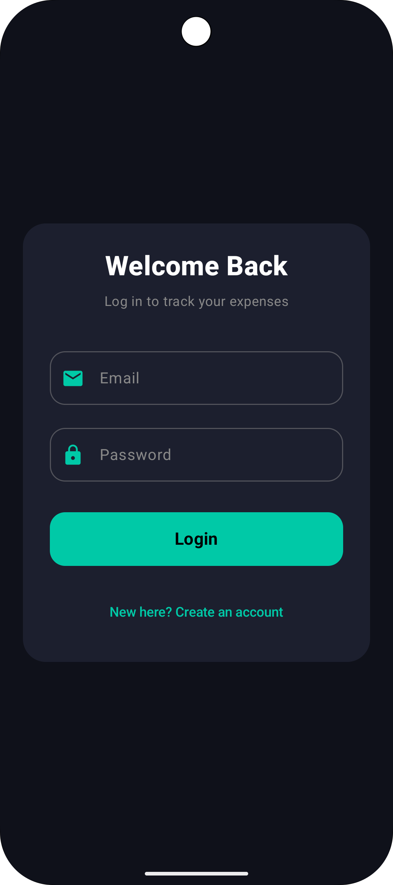
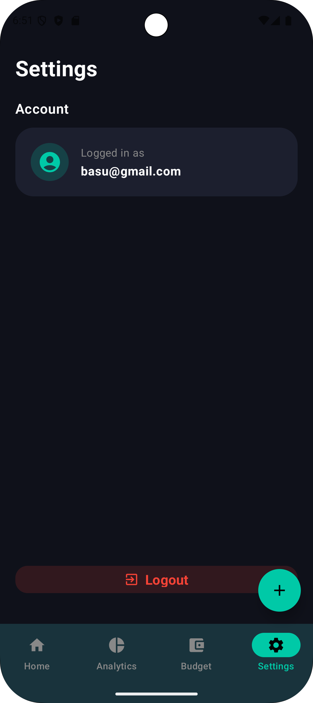

# 📊 All-In-One Expense Tracker

A modern, production-ready Android application built to help users seamlessly track their daily expenses, manage monthly budgets, and visualize their spending habits. Built entirely from scratch using **Kotlin**, **Jetpack Compose**, and **Firebase**.

---

## ✨ Key Features

* **☁️ Real-Time Cloud Sync:** Powered by Firebase Authentication and Firestore. Users can log in securely, and all transactions are synced to the cloud instantly.
* **🎯 Smart Monthly Budgeting:** Set a monthly spending limit. The app calculates your remaining balance in real-time and provides visual warnings (changing colors) if you go over budget.
* **📈 Interactive Analytics:** View detailed breakdowns of your spending using dynamic charts (weekly and monthly timelines).
* **📱 Modern UI/UX & Gestures:** Features a sleek, battery-saving Dark Theme, seamless screen navigation, and intuitive Swipe-to-Delete gestures for managing transactions.
* **💾 Persistent Local Storage:** Utilizes Android DataStore to permanently save user preferences and budget goals locally on the device.

---

## 📸 Screenshots

| Home & Transactions | Add / Edit Expense | Monthly Budgeting |
|:---:|:---:|:---:|
|  |  |  |
| *View real-time balances and swipe-to-delete transactions.* | *Categorize expenses and income with automatic date formatting.* | *Track your monthly spending limits with dynamic progress bars.* |

| Analytics Dashboard | Authentication | Dark Theme UI |
|:---:|:---:|:---:|
|  |  |  |
| *Visualize financial data with interactive charts.* | *Secure login with Firebase Authentication.* | *Premium, high-contrast dark mode design.* |

---

## 🛠️ Tech Stack & Architecture

This project was built following modern Android development best practices:

* **Language:** Kotlin
* **UI Toolkit:** Jetpack Compose (Declarative UI)
* **Architecture:** MVVM (Model-View-ViewModel) with `StateFlow` and `LaunchedEffect` for reactive state management.
* **Backend & Database:** Firebase Authentication & Cloud Firestore (NoSQL).
* **Local Storage:** Android Preferences DataStore.
* **Navigation:** Jetpack Compose Navigation.

---

## 🚀 How to Run the Project

If you want to clone this repository and run it locally, follow these steps:

1. Clone the repository:
   ```bash
   git clone [https://github.com/YourUsername/AllInOne-Expense-Tracker.git](https://github.com/YourUsername/AllInOne-Expense-Tracker.git)
